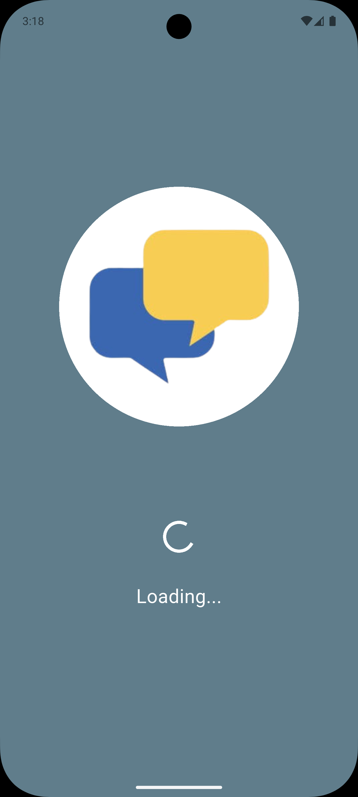
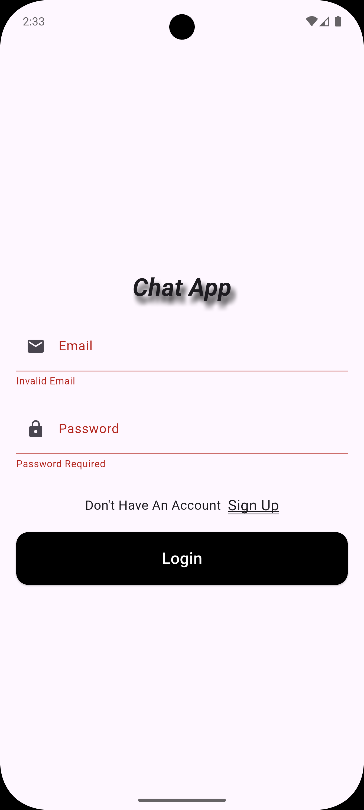
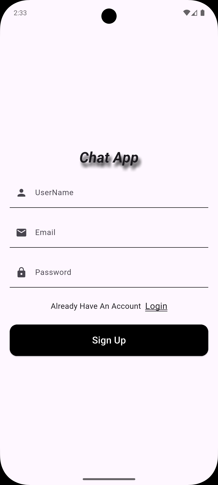
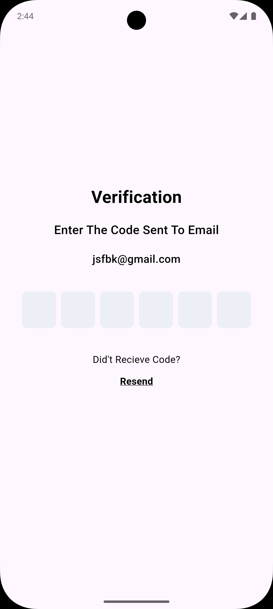
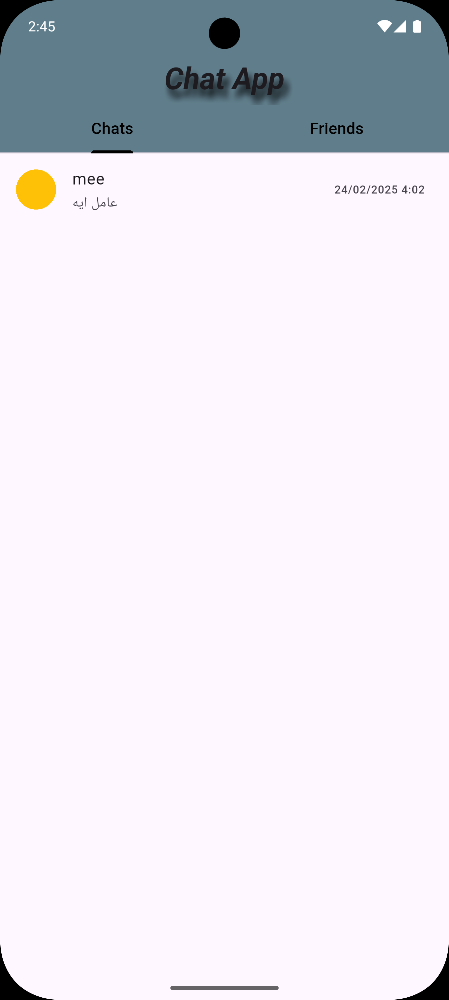
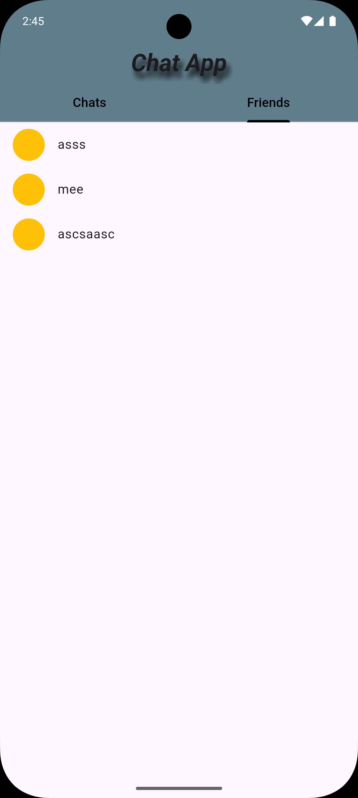
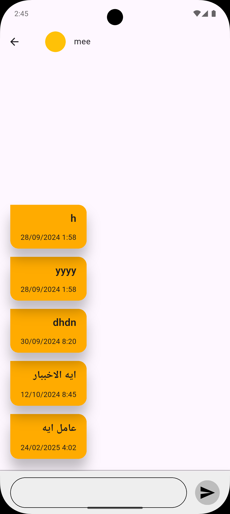
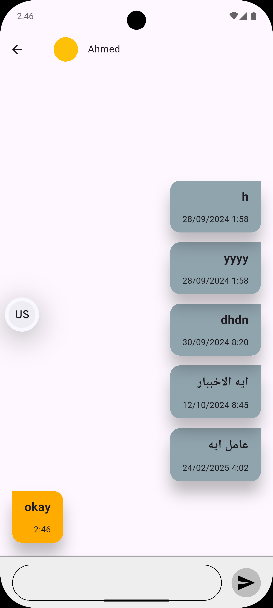

# Chat App

[](https://flutter.dev/)
[](https://dart.dev/)
[](LICENSE)

A real-time peer-to-peer (P2P) chat application built with [Flutter](https://flutter.dev/), featuring user authentication and validation, powered by [Firebase Authentication](https://firebase.google.com/products/auth) and [Cloud Firestore](https://firebase.google.com/products/firestore). This app allows users to securely chat with any other registered user in real-time.

## Features

- **Real-Time Messaging:** Instantly send and receive messages with other users.
- **User Authentication:** Secure sign up and login using Firebase Authentication.
- **User Validation:** Only validated users can participate in chats.
- **Firestore Integration:** All chats and user information are stored and retrieved using Cloud Firestore.
- **P2P Communication:** Chat directly with any other user in the app.
- **Flutter UI:** Modern, responsive, and cross-platform user interface.

## Screenshots

 &nbsp;&nbsp;&nbsp;  &nbsp;&nbsp;&nbsp;  &nbsp;&nbsp;&nbsp;  &nbsp;&nbsp;&nbsp;  &nbsp;&nbsp;&nbsp;  &nbsp;&nbsp;&nbsp;  &nbsp;&nbsp;&nbsp;  &nbsp;&nbsp;&nbsp;
<!-- Add your screenshots here -->
<!--  -->

## Getting Started

### Prerequisites

- [Flutter SDK](https://docs.flutter.dev/get-started/install)
- A Firebase project ([Create one here](https://console.firebase.google.com/))
- Android Studio or VS Code (recommended for development)

### Setup Instructions

1. **Clone this repository:**
   ```bash
   git clone https://github.com/AhmedAbdElrahman117/chat_app.git
   cd chat_app
   ```

2. **Install dependencies:**
   ```bash
   flutter pub get
   ```

3. **Configure Firebase:**
   - Create a new Firebase project in the [Firebase Console](https://console.firebase.google.com/).
   - Add Android and/or iOS apps to your Firebase project.
   - Download the `google-services.json` (for Android) and/or `GoogleService-Info.plist` (for iOS) and place them in the respective directories:
     - `android/app/google-services.json`
     - `ios/Runner/GoogleService-Info.plist`
   - Enable **Authentication** (Email/Password or other providers as needed).
   - Enable **Cloud Firestore**.

4. **Run the app:**
   ```bash
   flutter run
   ```

## Project Structure

- `lib/` - Main source code for the Flutter application
- `android/` - Android-specific configuration and code
- `ios/` - iOS-specific configuration and code

## Dependencies

Key packages used:

- [`firebase_core`](https://pub.dev/packages/firebase_core)
- [`firebase_auth`](https://pub.dev/packages/firebase_auth)
- [`cloud_firestore`](https://pub.dev/packages/cloud_firestore)

See `pubspec.yaml` for the full list.

## Usage

1. Register a new account or login with existing credentials.
2. Search for other users by username or email.
3. Start a chat and send messages in real-time.
4. All messages are instantly delivered and synchronized across devices.

## Contributing

Contributions are welcome! Please fork the repository and submit a pull request.

## License

This project is licensed under the [MIT License](LICENSE).

## Author

- [AhmedAbdElrahman117](https://github.com/AhmedAbdElrahman117)

